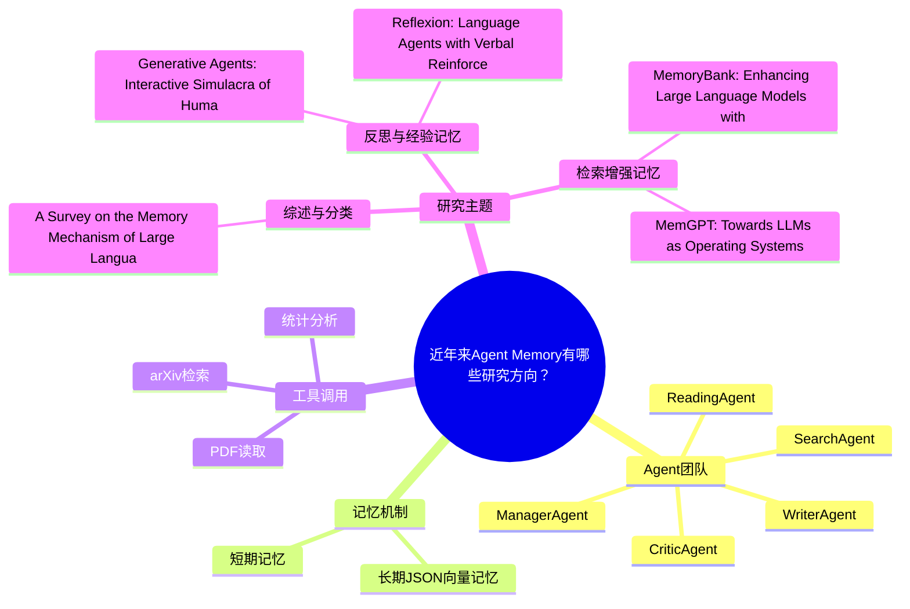

# Mindmap：近年来Agent Memory有哪些研究方向？

```mermaid
mindmap
  root((近年来Agent Memory有哪些研究方向？))
    Agent团队
      ManagerAgent
      SearchAgent
      ReadingAgent
      CriticAgent
      WriterAgent
    记忆机制
      短期记忆
      长期JSON向量记忆
    工具调用
      arXiv检索
      PDF读取
      统计分析
    研究主题
      综述与分类
        A Survey on the Memory Mechanism of Large Langua
      反思与经验记忆
        Generative Agents: Interactive Simulacra of Huma
        Reflexion: Language Agents with Verbal Reinforce
      检索增强记忆
        MemGPT: Towards LLMs as Operating Systems
        MemoryBank: Enhancing Large Language Models with
```
